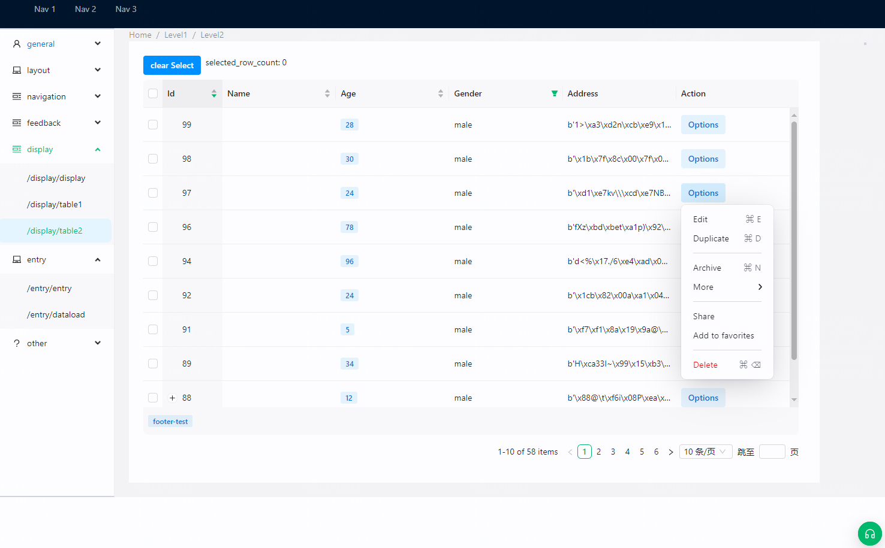
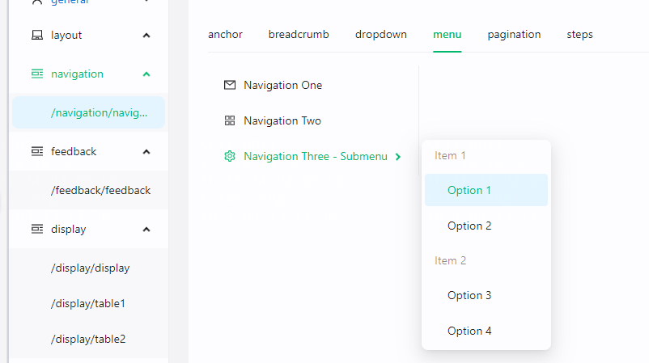
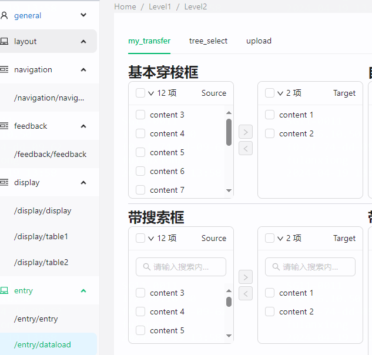

# reflex-antd

A [Reflex](https://github.com/reflex-dev/reflex) custom component wrap [ant.design](https://ant.design/).

pypi: [reflex-antd](https://pypi.org/pypi/reflex-antd/)

## Installation

```bash
pip install reflex-antd
```

## antd-demo

[antd-demo](https://antd-demo-teal-sun.reflex.run/)


### screen
- table

- menu

- transfer

- ...


## build
```
reflex component build
reflex component publish -t <pypi-token>

# ant-demo update
cd antd_demo/
reflex deploy
```

